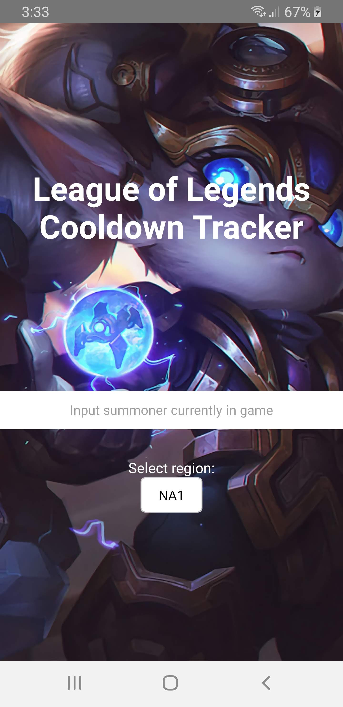
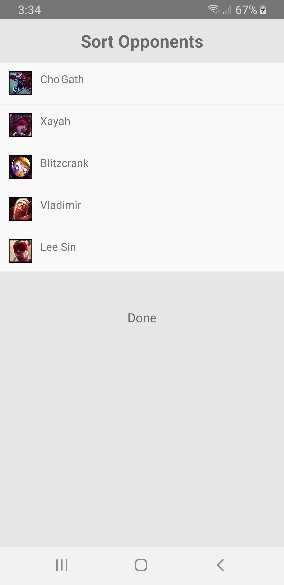
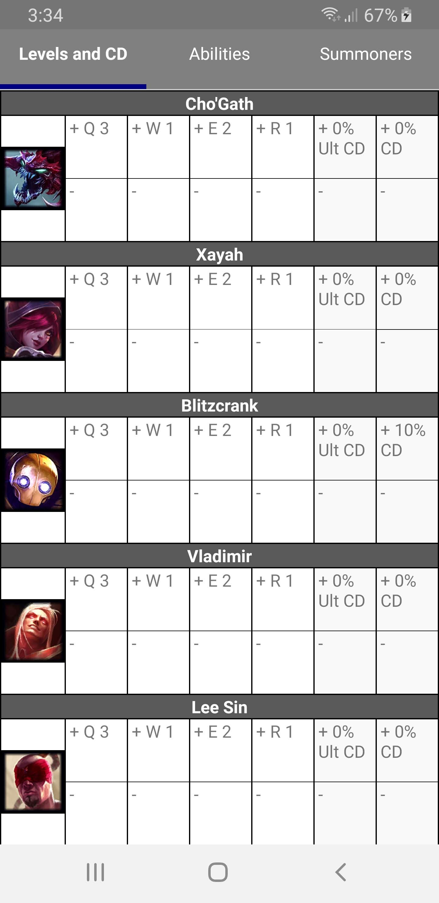
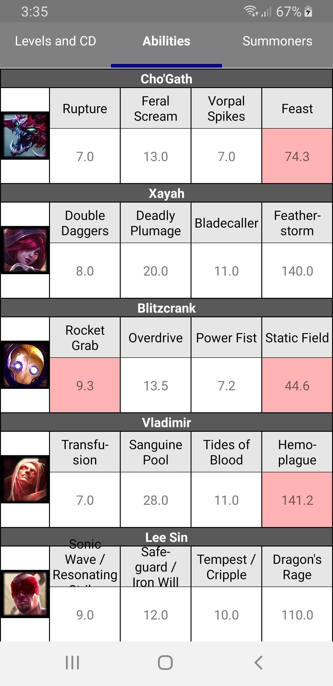
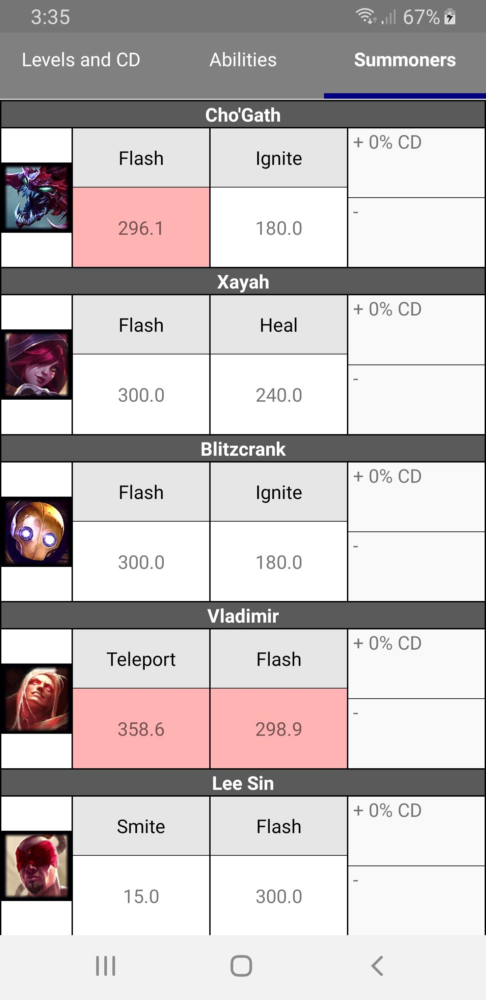

## League of Legends Cooldown Tracker

League of Legends Cooldown Tracker pulls in your current game info to allow you to track all the spell and summoner spells of your opponents. It lets you adjust spell levels, cooldown reduction percentages, and cooldown masteries for perfect timers to any ability.

## Images

             

             

             

             

## Legal Information

"League of Legends Cooldown Tracker" isn't endorsed by Riot Games and doesn't reflect the views or opinions of Riot Games or anyone officially involved in producing or managing League of Legends. League of Legends and Riot Games are trademarks or registered trademarks of Riot Games, Inc. League of Legends © Riot Games, Inc.

